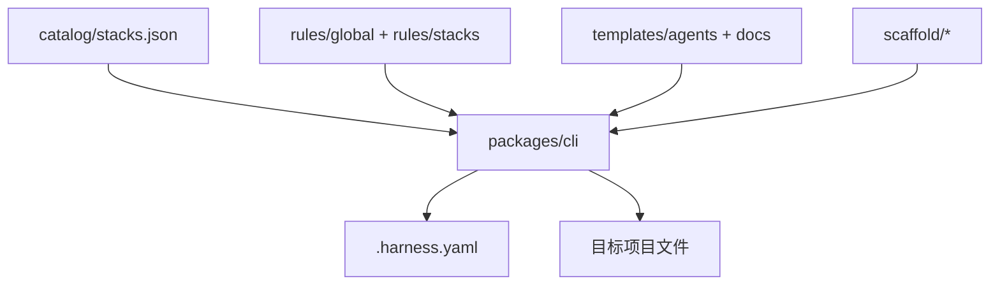

# Architecture

## 设计目标

team-harness 是**静态内容 + 安装器**，不是运行时服务。业务项目在 `init` 时把规则与模板**投影**到本地目录，由 Cursor / CodeBuddy 读取。

## 组件

## Manifest（`.harness.yaml`）

| 字段 | 含义 |
|------|------|
| `version` | 安装的 harness 包版本 |
| `ide` | `cursor` \| `codebuddy` \| `both` |
| `stacks` | 启用的规则包 id |
| `features` | precommit / ci / skills / skeleton / commands / agents |
| `installed[]` | 已安装文件清单（path, source, kind） |

`doctor` 对比 `installed` 与磁盘；`upgrade` 仅添加 catalog 中新增、manifest 中缺失的文件。

## 规则分层

| 层级 | 路径 | 说明 |
|------|------|------|
| Global | `rules/global/engineering.mdc` | 语言无关工程标准 |
| Git | `rules/global/git.mdc` | 分支、提交、pre-commit 约定 |
| Stack | `rules/stacks/<id>/*.mdc` | 按 `globs` 匹配文件类型 |

安装时规则文件**复制**到 `.cursor/rules/` 或 `.codebuddy/rules/`，文件名保持与源文件一致（如 `go.mdc`）。

## IDE 路径对照

| IDE | 规则 | 项目上下文 | 其他 |
|-----|------|------------|------|
| Cursor | `.cursor/rules/*.mdc` | `AGENTS.md` | `.cursor/plan/`, `.cursor/skills/` |
| CodeBuddy | `.codebuddy/rules/*.mdc` | `AGENTS.md` | `.codebuddy/plan/`, `.codebuddy/skills/` |
| Claude Code | `.claude/rules/*.md` | `CLAUDE.md` | `.md` 由 harness 从 `.mdc` 转换（`paths` frontmatter） |
| Codex CLI | （无独立 rules 目录） | `AGENTS.md` | `.codex/config.toml`；指令以 AGENTS 链为主 |

`ide: both` → Cursor + CodeBuddy。`ide: all` → 四种 IDE 目标。`ides` 数组记录解析后的目标列表。

`--ide cursor,claude` 可同时生成 `.mdc` 与 `.claude/rules/*.md` + `CLAUDE.md`。

## 栈检测

见 `catalog/stacks.json` 中各 stack 的 `detect` 数组。CLI 在 `init` 时扫描项目根（Dockerfile 浅层扫描子目录）。

## Schema

JSON Schema：`schema/harness.schema.json`  
示例：`examples/.harness.yaml`
