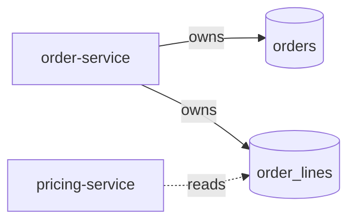

# System landscape

> Replace this entire file with your own once you have something real. The structure below is a starting skeleton.

## What this system is

One paragraph. Plain language. What does this codebase do, in user terms?

Example: *"The supply-chain system takes purchase orders from internal customers, matches them to supplier inventory, places orders with selected suppliers, tracks fulfillment, and reconciles incoming goods."*

## Top-level services

List each service, one paragraph each. Include:

- **Name** — short label
- **Owns** — what data / responsibility it owns
- **Calls** — which other services it depends on (synchronous)
- **Listens to** — which message topics it consumes (asynchronous)
- **Emits** — which message topics it produces

Example:

### `order-service`

- **Owns** — `orders`, `order_lines`, `order_status_history` tables.
- **Calls** — `pricing-service` (sync) for price lookup; `tenant-service` (sync) for permission checks.
- **Listens to** — `inventory.replenishment.v1` to release back-ordered lines.
- **Emits** — `order.created.v1`, `order.status_changed.v1`.

## Data ownership map

A single Mermaid diagram showing who owns which tables / topics, and who reads them. Keep it tight; if it gets unreadable, split into per-bounded-context views.

## Surprising things to know

The 3-5 things that bite new contributors. Not exhaustive — just the ones you'd warn someone about over coffee.

- *Example:* "All `created_at` timestamps are UTC except in `legacy_audit_log`, which is local time."
- *Example:* "The `order_lines.batch_price_status` field looks like it comes from the request, but it's back-filled by `PricingService` mid-flow."
